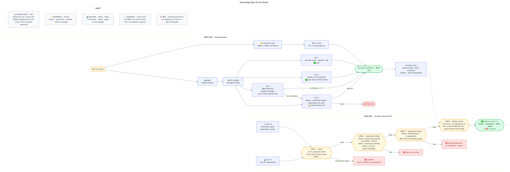

# Knowledge Base Access Model

A reference diagram for how visibility, comments, and edits are decided when an entry lives in the KB.



- **SVG (recommended for browsing):** [access-model.svg](access-model.svg)
- **PNG (for slide decks):** [access-model.png](access-model.png)
- **Mermaid source (editable):** [access-model.mmd](access-model.mmd)

## How to read it

The diagram has two halves. The **read side** answers "can user U see entry E?" by running E and U through four gates in order. The **write side** shows how an entry got into the KB in the first place (direct write vs. agent staging) and how `promote_entry` later widens access.

### The four read gates

1. **Zone** — Every user has an auto-created personal zone. New entries with no explicit sensitivity land there, and only the zone owner can see them (even admins are blocked via the normal API). Sharing requires `promote_entry`.
2. **Sensitivity ceiling** — The user's org role caps the highest sensitivity they can ever see:
   - `viewer` / `editor` ≤ shared, operational, meeting
   - `commenter` ≤ shared
   - `admin` = everything (including `system` / `strategic`)
3. **Department scope** — For editors, the entry's department must match the user's, OR the user owns the entry, OR there's an explicit grant.
4. **Explicit grants** — Per-entry or per-path grants to users or groups widen access. They are **additive only** (never restrict) and **cannot exceed the role ceiling** in Gate 2.

If the user passes all four gates, the output is their resolved role on that entry (`viewer` / `commenter` / `editor` / `admin`). Comments are available to anyone who can read.

### The write side (governance)

- **Interactive admins/editors** write directly through the web UI (Tier 1/2 auto-approve).
- **Agents (Claude sessions)** must use `submit_staging`. Every change is assigned a governance tier:
  - **Tier 1** — low-risk create/append/link → auto-approve
  - **Tier 2** — update on non-sensitive content → auto-approve after conflict check
  - **Tier 3** — high-sensitivity (system/strategic) → AI review (Sonnet 4.6); escalates to Tier 4 below confidence 0.7
  - **Tier 4** — delete, sensitivity change, governance rule mod → human admin review only

Once committed, `promote_entry` is how the owner widens access — adding principals (users/groups with a role) and optionally bumping sensitivity. Promotion is additive; it cannot downgrade or remove existing access.

## Worked example — "2027 Marketing Plan"

1. Head of marketing creates the entry with no explicit sensitivity → lands in their personal zone. Only they can see it.
2. They call `promote_entry` with `new_sensitivity: operational`, `department: marketing`, and grant the `marketing-leads` group `commenter`.
3. After promotion:
   - Marketing **editors** can read and edit (Gates 2+3 pass).
   - `marketing-leads` group members can **read and comment**, regardless of department (Gate 4 grant).
   - Engineering **editors** are blocked by Gate 3 (wrong department, no grant).
   - **Viewers** in any department are blocked by Gate 2 (operational > viewer's effective scope without a grant).
   - **Admins** see everything (Gate 2 ceiling = all).
4. If Claude later proposes an update, it goes through `submit_staging`; because the content is operational/strategic-adjacent it may route to Tier 3 AI review.

## Regenerating the diagram

```sh
cd docs
npx --yes -p @mermaid-js/mermaid-cli mmdc -i access-model.mmd -o access-model.svg -b transparent
npx --yes -p @mermaid-js/mermaid-cli mmdc -i access-model.mmd -o access-model.png -b white -w 2000 -H 1400
```

## Source of truth

The rules in this diagram come from:

- Personal zones + defaulting: [db/migrations/034_personal_zones.sql](../db/migrations/034_personal_zones.sql), [api/routes/entries.py](../api/routes/entries.py)
- Sensitivity ceilings + RLS: [db/migrations/019_permissions_v2_rls.sql](../db/migrations/019_permissions_v2_rls.sql), [db/migrations/004_rls.sql](../db/migrations/004_rls.sql)
- Groups + granular permissions: [db/migrations/018_principals_and_groups.sql](../db/migrations/018_principals_and_groups.sql), [api/routes/permissions.py](../api/routes/permissions.py)
- Promotion: [api/routes/zones.py](../api/routes/zones.py)
- Staging + governance tiers: [api/routes/staging.py](../api/routes/staging.py)

For implementation depth, see [ARCHITECTURE.md](../ARCHITECTURE.md).
